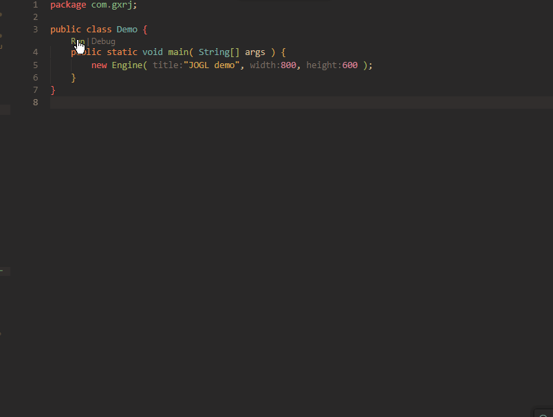

# opengl-java-demo

== Description

Just a "Hello World" for OpenGL in java by using Jogamp's Java for OpenGL (JOGL)

=== The bellow animation shows what you get by running this application:

=== Used tools:
- Java 21
- Gradle
- JOGL 2.5.0